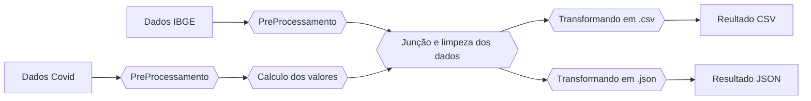

# Case Técnico | Data Engineer Jr. | Hurb

#### Gabriel Santos Madruga Oliveira
 
 Repositório feito para a resolução do case técnico que consiste em desenvolver de um pipeline de dados capaz de reunir dados gerais da covid-19 por Estado. A ferramenta utilizada para o desenvolvimento deste pipeline foi o ApacheBeam, pois a partir dela é possível realizar a divisão dos dados e desta forma, paralelizar o processamento dos mesmos.
 Outras vantagens notáveis do ApacheBeam são os diferentes runners que a ferramenta suporta (garantindo uma maior portabilidade do sistema) . Além disso, vale ressaltar a compatibilidade da ferramenta com linguagens de programação diversas, facilitando sua utilização em múltiplos cenários.

## Fluxo dos Dados

O fluxo de dados foi estruturado da seguinte forma:

- Inicialmente os arquivos passam por um pré-processamento de dados onde se geram as PCollections que serão futuramente ingeridas no pipeline de dados.
- Já dentro do pipeline de dados, os dados de covid são agrupados por Estado e se faz o cálculo do total de casos e óbitos.
- É feita a junção dos dados, resultando em somente uma PCollection com os valores finais.
- É feita a limpeza dos dados (eliminando rows sem informações do estado)
- A PCollection é formatada e escrita paralelamente em arquivos .json e .csv

## Utilização 

### Local

A versão do Python utilizada para a execução do código foi 3.10.4.
As bibliotecas necessárias para a execução do código se encontram no arquivo `requirements.txt` e podem ser instaladas a partir do comando (executado dentro do diretório raiz do projeto):

- `pip install -r requirements.txt`

A partir da biblioteca `click` podemos realizar o comando para a execução do programa a partir da linha de comando:
- `python src/main.py -d [ARQUIVO_COM_DADOS_COVID] -l [ARQUIVO_COM_DADOS_ESTADOS]`

Observação: Os arquivos devem estar na pasta `data`.

Exemplo de execução com os arquivos com o dataset inicial que esta no repositório.

- `python src/main.py -d HIST_PAINEL_COVIDBR_28set2020.csv -l EstadosIBGE.csv`

### Docker

